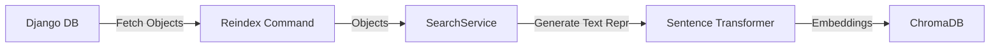
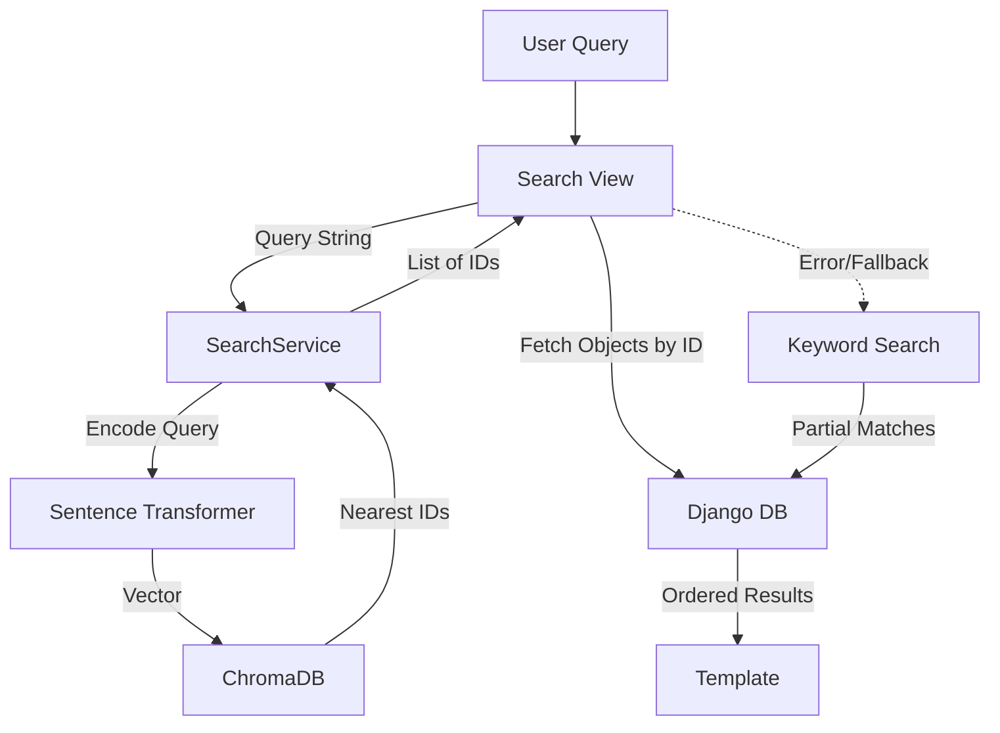

# Search Mechanism Documentation

This document outlines the architecture and workflow of the search functionality in the application, specifically focusing on the vector search implementation and its integration with the Django backend.

## Overview

The application utilizes a **hybrid search approach**:
1.  **Semantic Vector Search:** The primary mechanism for searching Tools, Stacks, and Professions, providing context-aware results.
2.  **Keyword Search (Fallback):** A robust fallback using Django ORM queries if the vector search service is unavailable or encounters errors.

## Technical Stack

*   **Database:** ChromaDB (Persistent local vector database)
*   **Embedding Model:** `sentence-transformers/all-MiniLM-L6-v2` (Runs locally, lightweight, CPU-friendly)
*   **Framework:** Django (Views & Management Commands)
*   **Python Libraries:** `chromadb`, `sentence_transformers`

## 1. Core Components

### A. Search Service (`tools/search.py`)
This singleton service handles all interactions with the vector database.

*   **Client Management:** Initializes a persistent ChromaDB client located at `chroma_db/` in the project root.
*   **Model Loading:** Loads the `all-MiniLM-L6-v2` model. This happens lazily to save resources.
*   **Collections:** Manages two distinct collections:
    *   `tools`: For individual AI tools.
    *   `stacks`: For curated tool stacks.
    *   `professions`: For user professions.
*   **Indexing Logic:**
    *   Converts database objects into rich text strings (Document) for embedding.
    *   **Tool (Tools Collection):**
        *   **Indexed fields:** `name`, `short_description` (en), `long_description` (en), `use_cases`, `tags`.
        *   **Document Format:** `Name: {name}. Description: {desc}. Use Cases: {cases}. Tags: {tags}`
    *   **ToolStack (Stacks Collection):**
        *   **Indexed fields:** `name`, `tagline`, `description`, `workflow_description`, `tools names`.
        *   **Document Format:** `Name: {name}. Tagline: {tagline}. Description: {desc}. Tools: {list_of_tools}. Workflow: {workflow}`
    *   **Profession (Professions Collection):**
        *   **Indexed fields:** `name`, `description`, `hero_tagline`.
        *   **Document Format:** `Name: {name}. Description: {desc}. Tagline: {tagline}`
    *   Stores Metadata (slug, pricing, visibility, owner_id) alongside vectors for filtering.

### B. Indexing Command (`tools/management/commands/reindex_search.py`)
A Django management command responsible for populating the vector database.

*   **Usage:** `python manage.py reindex_search`
*   **Process:**
    1.  Fetches all **published** Tools.
    2.  Fetches all ToolStacks.
    3.  Fetches all Professions.
    4.  Passes them to `SearchService` to generate embeddings and upsert into ChromaDB.

### C. Search View (`tools/views.py`)
The `search` view acts as the controller orchestration logic.

*   **Workflow:**
    1.  Receives user query (`?q=...`).
    2.  **Vector Search Step:**
        *   Calls `SearchService.search(query)` for Tools, Stacks and Professions.
        *   Retrieves object IDs based on semantic similarity.
        *   Fetches actual Django objects using these IDs, preserving the ranking order returned by the vector DB.
        *   **Filtering:** Applies visibility filters for Stacks (e.g., typically excluding private stacks unless specified).
    3.  **Fallback Step:**
        *   Wrapped in a `try...except` block.
        *   If ChromaDB fails, it executes standard `icontains` queries against the database to ensure the user still gets results.
    4.  **Result Limits:**
        *   **Tools:** Maximum 20 results.
        *   **Stacks:** Maximum 6 results.
        *   **Professions:** Maximum 6 results.
    5.  **Analytics:**
        *   Logs the query via `AnalyticsService` for search trend tracking.

## 2. Detailed Data Flow

### Indexing Flow


### Search Flow


## 3. Configuration & Maintenance
*   **Vector DB Path:** `BASE_DIR/chroma_db` (Ensure this directory is writable).
*   **Model:** Cached locally by `sentence_transformers`. First run may require internet access to download the model weights.
*   **Automatic Indexing:** The system uses Django signals (`post_save` and `post_delete`) to automatically keep the vector index in sync with the database. Any changes to Tools, Stacks, or Professions are immediately reflected.
*   **Manual Re-indexing:** A management command is provided for bulk initialization or full rebuilds (e.g., after a database restore or schema change).

  ```bash
  python manage.py reindex_search
  ```

## 4. Key Files

*   `tools/search.py`: Vector DB interface and embedding logic.
*   `tools/views.py`: Search view implementation (lines ~369).
*   `tools/management/commands/reindex_search.py`: Bulk indexing script.
