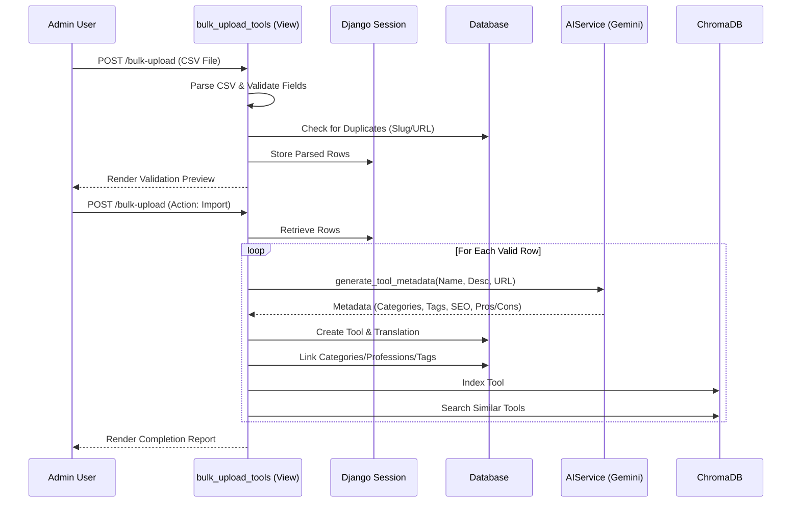

# Bulk Tool Import Workflow Analysis

## Overview
The bulk tool import feature (`/admin-dashboard/bulk-upload/`) is a staff-only, multi-step wizard designed to ingest CSV files containing AI tool data. It leverages AI (Gemini) to automatically enrich imported tools with metadata, taxonomics, and translations.

## Architecture

### 1. Components
- **View Logic**: `tools/views.py` (`bulk_upload_tools`)
  - Handles the state machine (Upload -> Validate -> Import -> Results).
  - Enforces `superuser` permission.
- **Frontend**: `templates/admin_bulk_upload.html`
  - A persistent single-page view that changes content based on the `step` context variable.
- **AI Integration**: `tools/ai_service.py`
  - `AIService.generate_tool_metadata`: Generates taxonomics (categories, professions, tags), SEO data, and extended descriptions.
- **Search Integration**: `tools/search.py`
  - Used to find similar tools during import to prevent semantic duplicates and build relationships.

### 2. Workflow Steps

#### Step 1: Upload & Parsing (`action='upload'`)
- **Input**: A CSV file (semicolon or comma separated).
- **Process**:
  - `csv.Sniffer` detects the delimiter.
  - Validates required columns: `Tool Name`, `Website URL`, `Short Description`.
  - **Duplicate Check**: Checks against existing tools by `slug` (derived from name) and `website_url` domain.
- **State**: Parsed rows (with status 'pending', 'skipped', or 'error') are stored in `request.session['bulk_upload_rows']`.
- **Output**: Renders the validation table (Preview).

#### Step 2: Confirmation & Execution (`action='import'`)
- **Input**: User confirmation from the validation screen.
- **Process**:
  - Iterates through the rows stored in the session.
  - **AI Enrichment**: For each valid row, calls `AIService.generate_tool_metadata`.
  - **Creation**:
    - Creates `Tool` object (featured by default).
    - Creates `ToolTranslation` (English).
    - creates/Gets `Category`, `Profession`, `Tag` objects and links them (Many-to-Many).
  - **Vector Search**: Indexes the new tool and searches for similar existing tools to display as "Similar Tools" in the report.
- **Output**: Renders the final results table showing success/failure for each row.

## Data Flow Diagram

## Key Observations & Risks

### 1. Synchronous Processing
The current implementation processes imports synchronously in the request-response cycle.
- **Risk**: Importing a large CSV (e.g., 50+ tools) will likely trigger an HTTP 504 Gateway Timeout (Nginx/Gunicorn defaults) because the AI calls are slow (~2-5s per tool).
- **Recommendation**: As noted in `BULK_UPLOAD.md`, this should be moved to a background task (Celery).

### 2. Session-Based State
The workflow relies on `request.session` to pass parsed data between the Validation and Import steps.
- **Pros**: Simple, no temporary database tables needed.
- **Cons**: If the session expires or is cleared between steps, the import will fail (`"No data to import"` error). Serializing large datasets into the session can also be problematic for memory.

### 3. AI Dependency
The import relies heavily on `AIService`.
- **Failure Mode**: If the AI service is down or rate-limited, the import for that row fails (caught in a generic `try/except` block), marking the row as 'error'.
- **Partial Success**: The process is not atomic. If the loop fails halfway (e.g., server restart), half the tools are created, and the user must manually figure out where to resume.

## Code References
- **View Logic**: `tools/views.py`: `bulk_upload_tools` (Line 1195)
- **Template**: `templates/admin_bulk_upload.html`
- **Documentation**: `BULK_UPLOAD.md`
