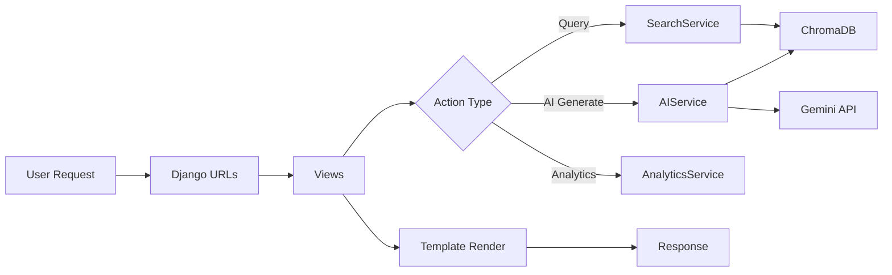
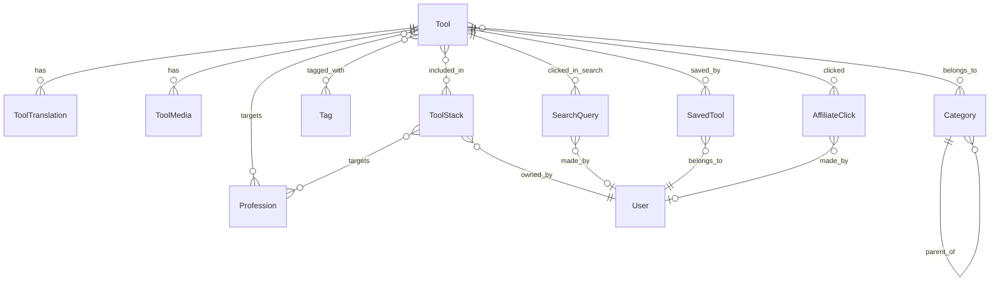

# AIJACK System Documentation & Improvement Analysis

**Generated:** 2026-01-11 (Updated)  
**Purpose:** Comprehensive system documentation with operational anomaly analysis and improvement recommendations.

---

## Table of Contents

1. [System Overview](#1-system-overview)
2. [Architecture](#2-architecture)
3. [Data Models](#3-data-models)
4. [Core Services](#4-core-services)
5. [Frontend & Design System](#5-frontend--design-system)
6. [Operational Anomalies](#6-operational-anomalies)
7. [Improvement Recommendations](#7-improvement-recommendations)
8. [Priority Matrix](#8-priority-matrix)

---

## 1. System Overview

AIJACK is an **AI Tools Intelligence Platform** built with Django that aggregates AI tools and provides semantic search capabilities. It targets professionals by profession/industry and offers curated tool stacks (bundles).

### Core Capabilities

| Feature | Technology | Status |
|---------|------------|--------|
| Semantic Search | ChromaDB + sentence-transformers | ✅ Working |
| AI Stack Builder | Google Gemini API | ✅ Working |
| Social Auth | django-allauth (Google, GitHub, Facebook) | ✅ Configured |
| SEO | Sitemaps, Schema.org, OpenGraph | ✅ Implemented |
| Multilingual | Model translations (EN, HU, DE) | ⚠️ Partial |
| Analytics Dashboard | AnalyticsService + Admin Dashboard | ✅ Implemented |
| Affiliate Tracking | AffiliateClick model | ✅ Implemented |
| User Saved Tools | SavedTool model | ✅ Implemented |

### Technology Stack

```
Backend:     Python 3.12 + Django 4.2
Database:    SQLite (dev) + ChromaDB (vectors)
Frontend:    Django Templates + Tailwind CSS (CDN) + Alpine.js
AI/ML:       sentence-transformers (all-MiniLM-L6-v2) + Google Gemini
Auth:        django-allauth
Env:         python-dotenv for environment management
```

---

## 2. Architecture

### Directory Structure

```
aijack/
├── config/              # Django project settings
│   ├── settings.py      # Main configuration (171 lines)
│   ├── urls.py          # Root URL routing
│   └── wsgi.py / asgi.py
├── tools/               # Main application
│   ├── models.py        # Data models (11 models, 345 lines)
│   ├── views.py         # View functions (13 views, 305 lines)
│   ├── search.py        # ChromaDB search service (143 lines)
│   ├── ai_service.py    # Gemini AI integration (99 lines)
│   ├── analytics.py     # Analytics service (177 lines)
│   ├── admin.py         # Admin configurations (131 lines)
│   ├── sitemaps.py      # SEO sitemaps (50 lines)
│   ├── templatetags/    # Custom template tags
│   └── management/commands/  # CLI commands (4 commands)
├── templates/           # Django templates (13 files)
│   ├── base.html        # Master template (648 lines)
│   ├── admin_dashboard.html  # Analytics dashboard
│   └── account/         # Auth templates
├── static/              # Static files
├── media/               # User uploads
├── chroma_db/           # ChromaDB persistence
└── conf/.env            # Environment variables
```

### Request Flow



---

## 3. Data Models

### Entity Relationship



### Model Summary

| Model | Purpose | SEO Support | Key Fields | Status |
|-------|---------|-------------|------------|--------|
| `SEOModel` | Abstract base | ✅ | meta_title, meta_description, og_image, canonical_url | ✅ |
| `Category` | Hierarchical categories | ✅ | name, slug, icon, parent | ✅ |
| `Profession` | Target user roles | ✅ | name, slug, description, hero_tagline | ✅ |
| `Tag` | Feature tags | ❌ | name, slug | ✅ |
| `Tool` | Core AI tool entity | ✅ | name, slug, pricing_type, status, website_url, affiliate_url | ✅ |
| `ToolTranslation` | Multilingual content | N/A | language, short_description, use_cases, pros, cons | ✅ |
| `ToolStack` | Curated tool bundles | ✅ | name, tagline, workflow_description, visibility, owner | ✅ |
| `ToolMedia` | Screenshots/videos for tools | N/A | tool, media_type, file, alt_text, caption, order | ✅ NEW |
| `SavedTool` | User's saved/favorited tools | N/A | user, tool, notes | ✅ NEW |
| `SearchQuery` | Analytics for searches | N/A | query, user, results_count, clicked_tool, source_page, filters_applied | ✅ NEW |
| `AffiliateClick` | Affiliate click tracking | N/A | tool, user, source_page, referrer, user_agent, ip_hash, converted, conversion_value | ✅ NEW |

---

## 4. Core Services

### 4.1 SearchService (`tools/search.py`)

**Purpose:** Semantic search using ChromaDB vector database.

**Key Methods:**

| Method | Purpose |
|--------|---------|
| `get_client()` | Singleton ChromaDB client |
| `get_model()` | Singleton SentenceTransformer model |
| `get_collection(name)` | Get or create ChromaDB collection |
| `generate_embedding(text)` | Generate embedding for text |
| `add_tools(tools)` | Index tools with embeddings |
| `add_stacks(stacks)` | Index stacks with embeddings |
| `search(query, n_results, collection_name, where)` | Semantic search with filters |

**Embedding Model:** `all-MiniLM-L6-v2` (lightweight, fast)

### 4.2 AIService (`tools/ai_service.py`)

**Purpose:** AI-powered tool recommendations using Google Gemini.

**Workflow:**
1. Receive user prompt
2. Perform semantic search (top 15 results)
3. Build context from search results
4. Call Gemini API with system instruction
5. Parse JSON response for tool slugs, title, description
6. Return matching Tool objects

**Fallback:** Returns semantic search results if API fails or no API key.

### 4.3 AnalyticsService (`tools/analytics.py`) — NEW

**Purpose:** Track user analytics including searches, tool clicks, and stack views.

**Key Methods:**

| Method | Purpose |
|--------|---------|
| `hash_ip(ip_address)` | Privacy-safe IP hashing (SHA-256) |
| `get_client_ip(request)` | Extract client IP from request |
| `log_search(request, query, ...)` | Log search queries |
| `log_tool_click(request, tool, source_page)` | Log affiliate/tool clicks |
| `log_stack_view(request, stack, source_page)` | Log stack views |
| `get_top_clicked_tools(limit, days)` | Get most clicked tools |
| `get_top_viewed_stacks(limit, days)` | Get most viewed stacks |
| `get_recent_searches(limit, days)` | Get recent search queries |
| `get_search_stats(days)` | Get aggregated search statistics |
| `get_click_stats(days)` | Get aggregated click statistics |

### 4.4 Management Commands

| Command | Purpose |
|---------|---------|
| `rebuild_index` | Rebuild semantic index for tools only |
| `reindex_search` | Re-index both tools and stacks |
| `seed_extended_data` | Seed database with sample data |
| `seed_massive_data` | Seed database with expanded dataset |

---

## 5. Frontend & Design System

### Design Language: "Neonpunk"

Based on `DESIGN_SYSTEM.md`:

- **Theme:** Light background with vibrant neon accents
- **Primary Color:** Sky Blue (`#0284c7`)
- **Effects:** Glassmorphism, neon glows, grid background
- **Typography:** Orbitron (headings) + Rajdhani (body)

### Key CSS Components

| Component | Class | Purpose |
|-----------|-------|---------|
| Cards | `.neon-card` | Glassmorphism containers |
| Buttons | `.neon-button-cyan`, `.neon-button-magenta` | Action buttons |
| Inputs | `.neon-input`, `.hero-search-input` | Form inputs |
| Badges | `.neon-badge-*` | Status indicators |
| Tools | `.tool-card` | Tool display cards |
| Stacks | `.stack-card` | Stack display cards |

### Template Structure

```
templates/
├── base.html              # Master template (648 lines, includes design system)
├── home.html              # Homepage with hero search
├── professions.html       # Profession listing
├── profession_detail.html # Profession landing page
├── tool_detail.html       # Individual tool page
├── stacks.html            # Stack listing
├── stack_detail.html      # Individual stack page
├── search.html            # Search results
├── my_stacks.html         # User's stacks
├── ai_stack_builder.html  # AI-powered builder
├── admin_dashboard.html   # Analytics dashboard (superusers only) — NEW
├── robots.txt             # SEO robots.txt
└── account/               # Auth templates
    ├── login.html
    └── logout.html
```

### URL Endpoints

| Path | View | Purpose |
|------|------|---------|
| `/` | `home` | Homepage with search |
| `/professions/` | `professions` | List all professions |
| `/profession/<slug>/` | `profession_detail` | Profession landing page |
| `/profession/<slug>/<pricing>/` | `profession_detail` | Filtered by pricing |
| `/tool/<slug>/` | `tool_detail` | Tool detail page |
| `/stacks/` | `stacks` | List all stacks |
| `/stack/<slug>/` | `stack_detail` | Stack detail page |
| `/search/` | `search` | Search results |
| `/my-stacks/` | `my_stacks` | User's stacks (auth required) |
| `/ai-builder/` | `ai_stack_builder` | AI stack builder |
| `/api/ai-generate-tools/` | `ai_generate_tools` | AJAX endpoint for AI suggestions |
| `/api/create-custom-stack/` | `create_custom_stack` | Save stack from AI Builder |
| `/admin-dashboard/` | `admin_dashboard` | Analytics dashboard (superusers only) — NEW |

---

## 6. Operational Anomalies

### 6.1 ~~Critical Issues~~ — RESOLVED ✅

> [!TIP]
> The following critical security issues have been **resolved** by moving to environment variables:

| ID | Issue | Resolution |
|----|-------|------------|
| ~~A1~~ | ~~Hardcoded SECRET_KEY in settings~~ | ✅ Now uses `os.getenv('DJANGO_SECRET_KEY')` |
| ~~A2~~ | ~~DEBUG=True hardcoded~~ | ✅ Now uses `os.getenv('DEBUG', 'False') == 'True'` |
| ~~A3~~ | ~~Empty ALLOWED_HOSTS~~ | ✅ Now uses `os.getenv('ALLOWED_HOSTS', '').split(',')` |
| **A4** | No test coverage | `tools/tests.py` (empty) | 🟠 Still pending |

### 6.2 Code Quality Issues

| ID | Issue | Location | Impact |
|----|-------|----------|--------|
| **B1** | Inconsistent import order | `tools/models.py:213` | Late import of `User` model |
| **B2** | Hardcoded price in Schema | `tools/models.py` | Always shows $0 or $10 |
| **B3** | Slug generation not unique-safe | `tools/views.py` | Potential collision |
| **B4** | Silent exception handling | Multiple locations | Debugging difficulty |

### 6.3 Architecture Issues

| ID | Issue | Description |
|----|-------|-------------|
| **C1** | No environment separation | Same settings for dev/staging/prod |
| **C2** | Tailwind via CDN | Not optimal for production |
| **C3** | All styles in base.html | 648 line template, hard to maintain |
| **C4** | No caching layer | ChromaDB queries on every search |
| **C5** | No rate limiting | API endpoints exposed |

### 6.4 ~~Missing Features~~ — IMPLEMENTED ✅

| Feature | Planned | Status |
|---------|---------|--------|
| ~~ToolMedia model~~ | ✅ In DEV.md | ✅ **Implemented** |
| ~~Affiliate tracking~~ | ✅ In DEV.md | ✅ **Implemented** (AffiliateClick) |
| ~~Admin analytics dashboard~~ | ✅ In DEV.md | ✅ **Implemented** (/admin-dashboard/) |
| ~~User saved tools~~ | ✅ In DEV.md | ✅ **Implemented** (SavedTool) |
| ~~Search analytics~~ | ✅ In DEV.md | ✅ **Implemented** (SearchQuery) |
| Coupon system | ✅ In DEV.md | ❌ Not implemented |
| Newsletter system | ✅ In DEV.md | ❌ Not implemented |
| Comparison feature | ✅ In DEV.md | ❌ Not implemented |
| hreflang multilingual SEO | ✅ In DEV.md | ❌ Not implemented |

### 6.5 ~~Sitemap Issues~~ — RESOLVED ✅

| Issue | Location | Resolution |
|-------|----------|------------|
| ~~Stack URL mismatch~~ | `sitemaps.py` | ✅ Fixed to use `/stack/{slug}/` |
| ~~No lastmod on Profession~~ | `models.py` | ✅ Added `updated_at` field to Profession model |
| ~~Exposes private stacks~~ | `sitemaps.py` | ✅ Now filters to `visibility='public'` only |

### 6.6 Duplicate Management Commands

Two commands with overlapping functionality:
- `rebuild_index` - indexes only tools
- `reindex_search` - indexes tools AND stacks

---

## 7. Improvement Recommendations

### 7.1 Completed Improvements ✅

1. **Environment-based configuration** — ✅ DONE
   - SECRET_KEY now from environment
   - DEBUG configurable via environment
   - ALLOWED_HOSTS from environment

2. **Analytics System** — ✅ DONE
   - AnalyticsService for tracking
   - Admin dashboard for superusers
   - Search query logging
   - Affiliate click tracking

3. **Enhanced Data Models** — ✅ DONE
   - ToolMedia for screenshots/videos
   - SavedTool for user favorites
   - SearchQuery for analytics
   - AffiliateClick for tracking

### 7.2 Still Pending

1. **Rate limiting** - Implement Django-ratelimit for AI endpoints

2. **Split base.html** - Extract CSS to separate stylesheet

3. **Fix import order** - Move User import to top of models.py

4. **Unique slug generation** for user-created stacks

5. **Proper logging** - Replace `print()` statements with Django logging

6. **Add type hints** - Improve code readability and IDE support

### 7.3 Testing (Still Needed)

1. **Unit tests** for models, services
2. **Integration tests** for views
3. **API tests** for JSON endpoints
4. **Search tests** for ChromaDB integration

### 7.4 Performance (Still Needed)

1. **Implement caching**
   - Redis/Memcached for search results
   - Template fragment caching

2. **Database optimization**
   - Add indexes on frequently queried fields
   - Implement select_related/prefetch_related consistently

3. **Static files**
   - Move Tailwind to build process
   - Implement WhiteNoise for static serving

### 7.5 Remaining Features to Complete

| Priority | Feature | Effort |
|----------|---------|--------|
| Medium | Coupon system | Medium |
| Medium | Multilingual hreflang | Medium |
| Low | Newsletter system | High |
| Low | Comparison feature | Medium |

### 7.6 Sitemap Fixes Needed

1. Fix URL path mismatch (`/stacks/` vs `/stack/`)
2. Add `updated_at` to Profession model
3. Filter private stacks from sitemap

---

## 8. Priority Matrix

```
                    IMPACT
                High ─────── Low
              │
        High  │  C5          B1
              │  (rate limit)
    URGENCY   │
              │  C1-C2       C3
        Low   │  B2-B3       B4
              │
```

### Recommended Implementation Order

1. **Phase 1 (Security)** - 1 day
   - [x] Environment configuration for secrets ✅
   - [ ] Add rate limiting for API endpoints

2. **Phase 2 (Stability)** - 2-3 days
   - [ ] Add basic test suite
   - [ ] Fix sitemap URL inconsistencies
   - [ ] Implement proper logging

3. **Phase 3 (Performance)** - 3-5 days
   - [ ] Add caching layer
   - [ ] Optimize database queries
   - [ ] Build-time CSS processing

4. **Phase 4 (Features)** - Ongoing
   - [x] User saved tools/stacks ✅
   - [x] Analytics dashboard ✅
   - [ ] Coupon system
   - [ ] Newsletter integration

---

## Appendix: File Reference

### Core Files Modified Frequently

| File | Lines | Purpose |
|------|-------|---------|
| `tools/models.py` | 345 | All data models (11 models) |
| `tools/views.py` | 305 | View functions (13 views) |
| `tools/search.py` | 143 | Vector search |
| `tools/ai_service.py` | 99 | Gemini integration |
| `tools/analytics.py` | 177 | Analytics service (NEW) |
| `templates/base.html` | 648 | Master template + CSS |

### Configuration Files

| File | Purpose |
|------|---------|
| `config/settings.py` | Django configuration (171 lines) |
| `config/urls.py` | Root URL routing |
| `tools/urls.py` | App URL routing (18 endpoints) |
| `conf/.env` | Environment variables |

### Related Documentation

- `DEV.md` - Product vision and roadmap
- `DEV_FINAL.md` - Final development notes
- `DESIGN_SYSTEM.md` - UI/UX design system
- `SEO_GUIDELINES_2025_2026.md` - SEO strategy

---

*This document was updated on 2026-01-11 through comprehensive codebase analysis. It should be updated as the system evolves.*
