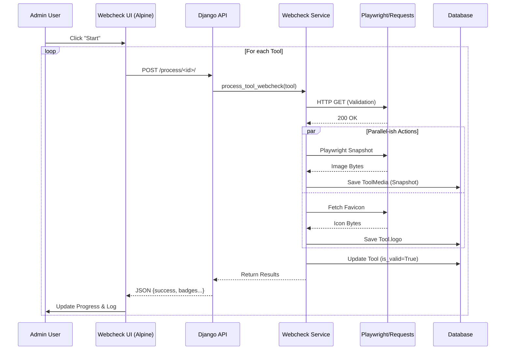

# Tool Website Checker & Logo Capturer Documentation

## 1. Overview
The **Tool Website Checker & Logo Capturer** (internally referred to as "Webcheck") is an automated maintenance system designed to verify the validity of external tool URLs and automatically generate visual assets (snapshots, favicons) for the directory.

It operates as a batch process, allowing admins to validate hundreds of tools efficiently while populating missing data like logos and SEO metadata.

## 2. Architecture & Components

### 2.1 Database Models
The feature primarily interacts with the `Tool` and `ToolMedia` models.

| Model | Field | Purpose |
|-------|-------|---------|
| **Tool** | `is_website_valid` | Boolean flag. `True` if URL returns 200 OK, `False` if error or parked domain. |
| **Tool** | `webcheck_last_run` | Timestamp of the last check. |
| **Tool** | `website_url` | The target URL being checked. |
| **Tool** | `logo` | Stores the downloaded favicon if no logo exists. |
| **Tool** | `media` | Relation to `ToolMedia` for storing snapshots. |
| **Tool** | `meta_title` | Updated from website HTML `<title>` if empty. |
| **Tool** | `meta_description` | Updated from website meta tag if empty. |
| **ToolMedia** | `file` | Stores the generated snapshot image. |
| **ToolMedia** | `media_type` | Set to `'image'` for snapshots. |

### 2.2 Backend Logic (`tools/webcheck.py`)
This module contains the core processing logic using **Playwright** and **Requests**.

1.  **`check_url(url, session)`**:
    -   Sends a standard HTTP GET request with a user agent.
    -   Validates the status code is 200.
    -   **Parked Domain Detection**: Scans response text for keywords like "domain is for sale", "godaddy", "sedo" to identify invalid tools that technically resolve but are dead.
    -   **Metadata Extraction**: Uses `BeautifulSoup` to parse `<title>` and `<meta name="description">`.

2.  **`take_snapshot(url)`**:
    -   Launches a **headless Chromium** browser via `sync_playwright`.
    -   Navigates to the URL and waits for `networkidle` state.
    -   Captures a screenshot of the top viewport (1280x600).
    -   Returns the raw image bytes.

3.  **`get_favicon(url, session)`**:
    -   Attempts to fetch `/favicon.ico` from the root domain.
    -   Converts the image to PNG format using `PIL` (Pillow) to ensure compatibility.

4.  **`process_tool_webcheck(tool)`**:
    -   Orchestrator function called by the API.
    -   Runs `check_url` first. If invalid, stops and marks tool as invalid.
    -   If valid:
        -   **Snapshot**: Checks if `ToolMedia(type='image')` exists. If not, calls `take_snapshot` and saves it.
        -   **Faivcon**: Checks if `Tool.logo` is empty. If so, calls `get_favicon` and saves it.
        -   **Metadata**: Updates `meta_title` and `meta_description` if they are currently empty on the `Tool` model.

### 2.3 API Endpoints (`tools/views.py`)
The frontend communicates with the backend via these JSON endpoints:

-   **GET `/api/webcheck/pending/`** (`api_get_pending_webcheck_tools`)
    -   Fetches tools where `is_website_valid` IS NULL OR `webcheck_last_run` IS NULL.
    -   Limit: 500 items per batch.
    -   Returns: JSON list of tools `{id, name, website_url, slug}`.

-   **POST `/api/webcheck/process/<int:tool_id>/`** (`api_process_webcheck_tool`)
    -   Triggers `process_tool_webcheck(tool)` for a single tool.
    -   Returns: JSON result `{success: true, results: {...}}` or error.

### 2.4 User Interface

#### Entry Point
Located in `templates/admin_tools_list.html`.
-   **Button**: "Webcheck" (Icon: `fa-robot`)
-   **Location**: Top filter bar, next to "Incomplete" filter.
-   **URL**: ``

#### Progress Dashboard (`templates/admin_webcheck_progress.html`)
A single-page application built with **Alpine.js** (`x-data="webcheckApp()"`).

**Key UI Elements:**
1.  **Status Header**: Shows "Ready", "Processing...", or "Process complete".
2.  **Counters**: "Processed: X / Total".
3.  **Controls**:
    -   **Start**: Begins the batch loop.
    -   **Stop**: Sets `isRunning = false` to pause after the current item.
    -   **Refresh**: Re-fetches the pending list from the API.
4.  **Progress Bar**: Visual indication of batch completion percentage.
5.  **Live Log**:
    -   Scrollable list of processed items.
    -   **Status Icons**: Pending (Grey), Spinner (Blue), Success (Green), Error (Red).
    -   **Result Badges**:
        -   `URL INVALID` (Red)
        -   `SNAPSHOT` (Blue - Indicates a new snapshot was taken)
        -   `FAVICON` (Purple - Indicates logo was found)
        -   `META` (Yellow - Indicates metadata was updated)

## 3. User & Data Flow

### 3.1 Initialization Flow
1.  **User** clicks "Webcheck" on the Admin Tools list.
2.  **Browser** loads `/admin-dashboard/webcheck/`.
3.  **Alpine.js** (`init()`) automatically calls `fetchPending()`.
4.  **API** returns list of up to 500 unchecked tools.
5.  **UI** displays "Ready to check X tools".

### 3.2 batch Processing Flow
1.  **User** clicks "Start".
2.  **Alpine.js** sets `isRunning = true` and iterates through the `pendingTools` array.
3.  **Loop Step**:
    a.  UI adds a "Processing" log entry to the top of the list.
    b.  **POST** request sent to `/api/webcheck/process/<id>/`.
    c.  **Backend** (`process_tool_webcheck`):
        -   Validates URL.
        -   (If valid) Spawns headless browser for snapshot.
        -   (If valid) Fetches favicon.
        -   (If valid) Updates DB records.
    d.  **Backend** returns JSON results.
    e.  **Alpine.js** updates the log entry:
        -   Changes icon to Checkmark/X.
        -   Appends result badges (Snapshot, Favicon, etc.).
        -   Updates progress bar.
4.  **Termination**:
    -   Loop finishes or User clicks "Stop".
    -   UI shows "Process complete".

### 3.3 Data Flow Diagram

## 4. Troubleshooting & Edge Cases

-   **"Network Error" in UI**: Usually means the request timed out. Snapshot generation can take >10 seconds.
    -   *Fix*: Ensure server timeout settings allow for ~30s requests.
-   **Zombie Processes**: If many snapshots run, check for orphaned Chromium processes on the server.
-   **False Negatives**: Some valid sites block the bot User-Agent.
    -   *Current UA*: `Mozilla/5.0 ... Chrome/91.0...` (Mimics standard browser).
-   **Parked Domain Detection**: The tool currently checks for keywords like "godaddy" in the HTML. If a site is legitimately hosted on a provider that inserts these keywords, it might be flagged as invalid.

## 5. Future Improvements
-   **Async Task Queue**: Move processing to Celery/Redis to avoid browser timeout issues on the main thread.
-   **Smart Retries**: Retry failed network requests once before marking as invalid.
-   **Domain Whitelisting**: Skip "Parked Domain" check for specific trusted domains.
